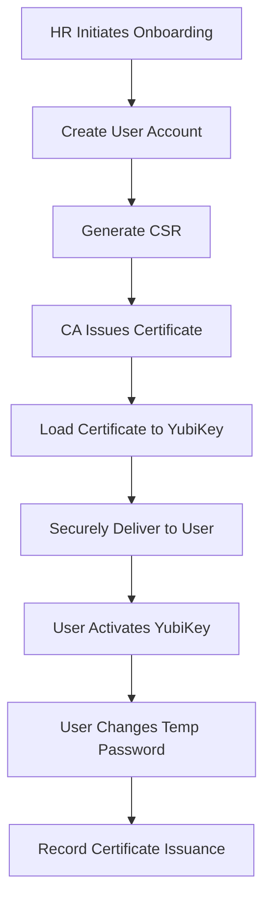
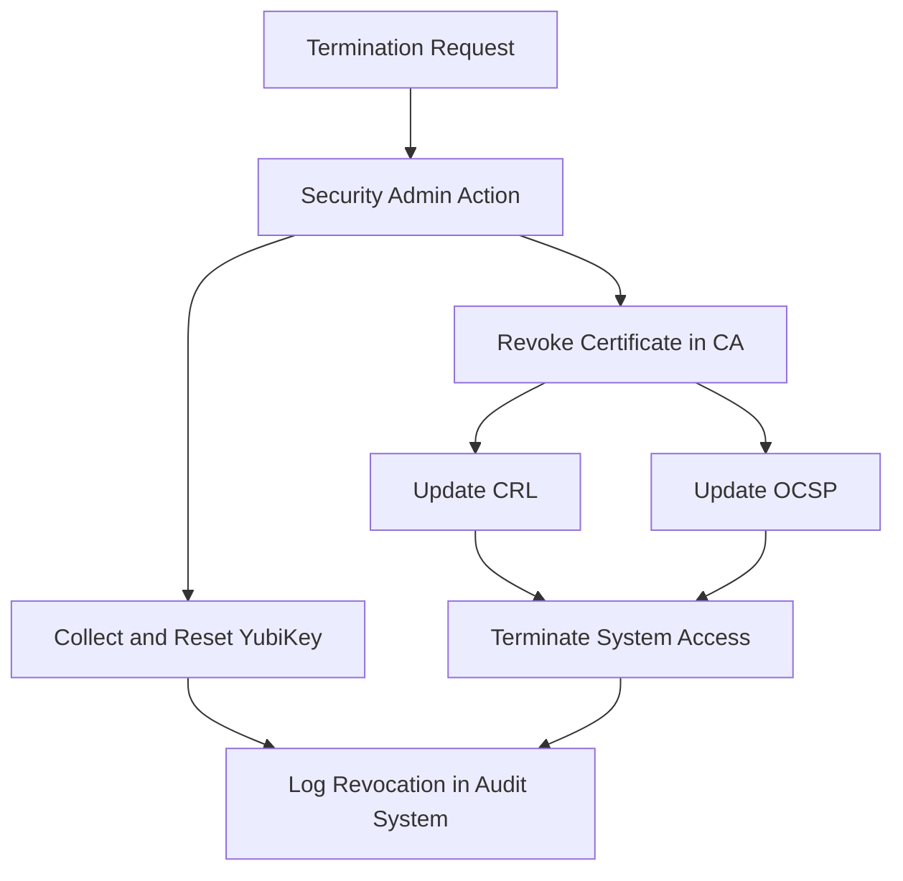
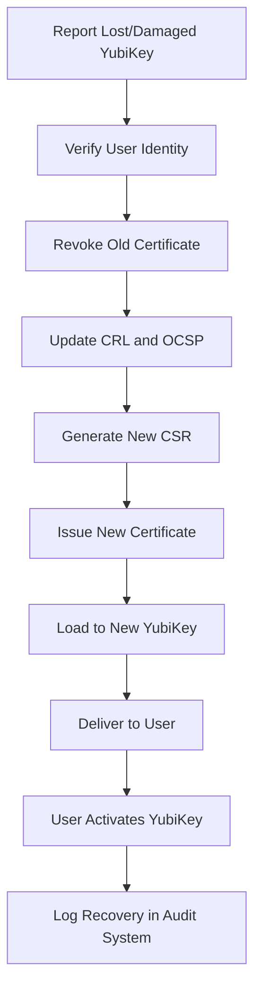

# PKI Infrastructure Documentation and Security Policy

## Overview

This document outlines the Public Key Infrastructure (PKI) implemented for the company, detailing the Certificate Authority (CA) structure, certificate management processes, security controls, and compliance measures. The PKI provides secure identity management for both users and services, supporting encryption in transit and at rest to meet compliance requirements.

## CA Structure

### Hierarchy

1. **Root CA**
   - Purpose: Issues certificates only to intermediate CAs
   - Security: Offline, air-gapped system
   - Validity: 10 years
   - Key size: RSA 4096 bits

2. **Intermediate CA**
   - Purpose: Issues certificates to users and services
   - Security: Online but heavily restricted
   - Validity: 5 years
   - Key size: RSA 3072 bits

### Certificate Properties

1. **User Certificates**
   - Purpose: Authentication, signing, encryption
   - Validity: 2 years
   - Key size: RSA 3072 bits
   - Storage: YubiKeys (preferred) or secure software storage

2. **Service Certificates**
   - Purpose: Service authentication, TLS/SSL
   - Validity: 1 year
   - Key size: RSA 3072 bits
   - Storage: Secure service configuration

## Secure Communication Policy

### Allowed Protocols and Ciphers

| Protocol | Status | Justification |
|----------|--------|---------------|
| TLS 1.3 | Allowed (Preferred) | Most secure, modern protocol |
| TLS 1.2 | Allowed | Secure with proper cipher configuration |
| TLS 1.0 | Allowed with restrictions | Required by brief, only with secure ciphers |
| SSLv3 | Forbidden | Insecure (POODLE vulnerability) |
| SSLv2 | Forbidden | Severely insecure |

### Allowed Cipher Suites

| Cipher Suite | Status | Justification |
|--------------|--------|---------------|
| ECDHE-ECDSA-AES256-GCM-SHA384 | Allowed (Preferred) | Forward secrecy, strong encryption |
| ECDHE-RSA-AES256-GCM-SHA384 | Allowed | Forward secrecy, strong encryption |
| ECDHE-ECDSA-CHACHA20-POLY1305 | Allowed | Strong on platforms without AES-NI |
| ECDHE-RSA-CHACHA20-POLY1305 | Allowed | Strong on platforms without AES-NI |
| ECDHE-ECDSA-AES128-GCM-SHA256 | Allowed | Forward secrecy, good performance |
| ECDHE-RSA-AES128-GCM-SHA256 | Allowed | Forward secrecy, good performance |

### Forbidden Cipher Suites

| Cipher Suite | Justification |
|--------------|---------------|
| RC4 based | Known vulnerabilities |
| DES/3DES based | Vulnerable to Sweet32 attack |
| MD5 based | Cryptographically broken |
| SHA-1 based | Cryptographically vulnerable |
| NULL ciphers | No encryption |
| Anonymous DH | No authentication |

### Protocol Restrictions

| Protocol | Restriction | Justification |
|----------|-------------|---------------|
| LDAP | Forbidden without Sign&Seal | Transmits credentials in cleartext |
| LDAPS | Required for directory services | Secure alternative to LDAP |
| FTP | Forbidden | Cleartext protocol |
| SFTP/SCP | Required for file transfers | Secure alternative to FTP |
| HTTP | Restricted to internal services only | Cleartext protocol |
| HTTPS | Required for all web services | Encrypted alternative to HTTP |

## Identity Provider Components

### X.509 Certificates
- Primary method for authentication and encryption
- Issued through the company CA infrastructure
- Used for TLS/SSL, VPN access, and client authentication

### YubiKeys
- Physical security tokens for certificate storage
- FIPS 140-2 validated
- Protection against extraction of private keys
- PIN protection for access control
- Tamper-evident design

### PGP Keys (Optional)
- Used for secure email and document signing
- Integration with company email system
- Managed through centralized key server

## User Identity Management Workflows

### 1. New User Onboarding Flow
1. HR initiates onboarding process in HR system
2. Automated workflow creates user account in identity management system
3. IT generates certificate signing request (CSR)
4. Intermediate CA issues certificate
5. Certificate is loaded onto YubiKey
6. YubiKey and temporary credentials are provided to user through secure channels
7. User activates YubiKey with PIN during orientation
8. User changes temporary password on first login
9. System records completion of certificate issuance

### 2. Identity Revocation Flow
1. Manager/HR initiates termination or revocation process
2. Security admin revokes certificate in CA system
3. Certificate is added to Certificate Revocation List (CRL)
4. OCSP responder is updated with revocation status
5. YubiKey is collected and reset (if available)
6. User access is terminated across all systems
7. Revocation is logged in audit system

### 3. Identity Recovery Flow
1. User reports lost/damaged YubiKey to IT helpdesk
2. User identity verified through alternative means (manager approval, ID verification)
3. Old certificate is revoked and added to CRL
4. OCSP responder is updated
5. New CSR is generated for user
6. New certificate is issued by CA
7. New certificate is loaded onto new YubiKey
8. YubiKey is delivered to user with temporary PIN
9. User activates new YubiKey with PIN
10. Recovery is logged in audit system

## Certificate Distribution and Management

### Emitting a New Service Certificate

1. Service owner generates CSR with required attributes (service FQDN as CN)
2. Request is submitted through certificate management portal with business justification
3. Security admin approves request based on policy compliance
4. Intermediate CA issues certificate
5. Certificate and private key are securely delivered to service owner
6. Certificate is deployed to service through configuration management
7. Certificate issuance is logged in certificate inventory system
8. Certificate is added to monitoring for expiration tracking

### Emitting a New User Certificate

1. User or admin generates CSR based on identity verification
2. Request is submitted through certificate management portal
3. Manager approves request
4. Certificate is issued by Intermediate CA
5. Certificate is stored on YubiKey
6. YubiKey is securely delivered to user
7. User activates YubiKey with PIN
8. Certificate issuance is logged in certificate inventory system

### Certificate Management Processes

#### Centralized Inventory
- All certificates tracked in centralized inventory system
- Automated discovery of certificates on network
- Regular reconciliation between inventory and active certificates
- Reporting on certificate status, expiration, and compliance

#### Renewal Process
1. Automated alerts at 60, 30, and 15 days before expiration
2. Certificate owners notified of pending expiration
3. Automated renewal process for eligible certificates
4. CSR generated from existing certificate data
5. New certificate issued maintaining the same key if possible
6. Certificate deployed to service/user
7. Renewal logged in certificate inventory system

#### Certificate Revocation
1. Request for revocation submitted with justification
2. Security admin reviews and approves revocation
3. Certificate revoked in CA
4. CRL updated and published
5. OCSP responder updated
6. Systems configured to check both CRL and OCSP
7. Revocation logged in audit system

## End-to-End Encryption Strategy

Our primary end-to-end encryption strategy uses certificate-based mutual TLS (mTLS) authentication for the following reasons:

1. **Strong Authentication**: mTLS provides strong identity verification for both client and server, ensuring only authorized entities can establish connections.

2. **PKI Integration**: Seamlessly integrates with our existing PKI infrastructure, leveraging the same certificates for authentication and encryption.

3. **Security in Transit**: Ensures data confidentiality and integrity during transmission with strong encryption algorithms.

4. **Broad Support**: Well-supported in modern web servers, applications, and programming languages.

5. **Scalability**: Can be effectively managed and scaled across the enterprise through our certificate management processes.

For specific use cases (such as email), we employ additional encryption technologies:

1. **S/MIME**: For secure email using X.509 certificates
2. **PGP/GPG**: For document signing and encryption
3. **Full Disk Encryption**: For data-at-rest protection

## Implementation Architecture

The implemented PKI system consists of the following components:

1. **EasyRSA CA**: Manages the certificate authority functions
   - Root CA (offline)
   - Intermediate CA (online)
   - Certificate generation and management

2. **Flask Web Application**: Provides user interface for certificate management
   - User authentication via password or certificate
   - Certificate request and issuance
   - Certificate revocation and recovery
   - User management for administrators

3. **Nginx Reverse Proxy**: Handles client certificate authentication
   - TLS termination with strong cipher configuration
   - Client certificate validation
   - Integration with the web application

4. **Database**: Stores certificate metadata and user information
   - Certificate inventory
   - User accounts
   - Audit logging

## Security Considerations

1. **Private Key Protection**:
   - Root CA private key stored offline in hardware security module (HSM)
   - Intermediate CA private key protected by strong access controls
   - User private keys stored on YubiKeys or other secure hardware

2. **Access Controls**:
   - Strict separation of duties for CA operations
   - Multi-factor authentication for administrative access
   - Privileged access management for CA administrators

3. **Audit and Logging**:
   - Comprehensive logging of all certificate operations
   - Regular review of CA activities
   - Tamper-evident logs

4. **Business Continuity**:
   - Regular backups of CA database
   - Disaster recovery procedures for CA infrastructure
   - Testing of recovery processes

## Conclusion

This PKI infrastructure provides a robust foundation for secure identity management and communication within the company. By following the procedures outlined in this document, the company can maintain compliance with security requirements for data in transit and at rest while providing a user-friendly experience for certificate management.

Regular reviews and updates to this policy are necessary to ensure continued alignment with evolving security practices and business needs.
